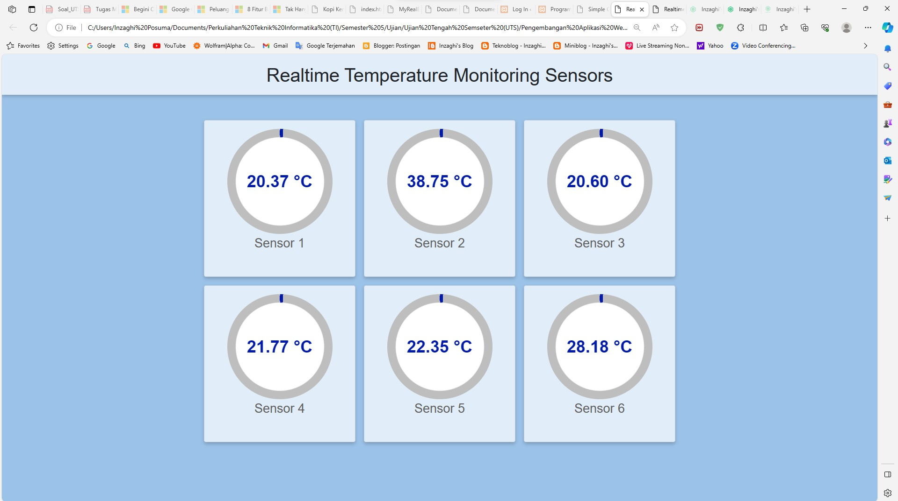

# realtime-temperature-sensor-monitoring-webapp

Web-Based Applications Developments (Webdev) Project for Realtime Temperature Sensor Monitoring Web App GUI. It's only User Interface (UI), the Sensors are only uses the Random Numbers with JavaScript.

## Images
Inilah Tampilan Sederhana dari Aplikasi Web Monitoring Sensor Suhu :
\
\

## Description

**1. [Project Realtime Temperature Sensor GUI](./realtime-temperature-sensor-gui)**
  
Merupakan Project Aplikasi Monitoring Sensor Suhu Sederhana yang terdiri dari:
- HTML
- CSS
- JavaScript
- Bootstrap
- jQuery

**2. [Project Realtime Temperature Sensor GUI Node.js](./realtime-temperature-sensor-gui-node)**
  
Merupakan Lanjutan dari Project Aplikasi Monitoring Sensor Suhu Sederhana (yang di Nomor 1) yang menggunakan Framework Node.js. Untuk Project ini, melakukan Update Data secara Realtime menggunakan WebSockets, dan Server-nya menggunakan JavaScript.

Steps :
1. Persiapan Project

Pertama, buatlah direktori baru untuk proyek Anda dan masuk ke dalamnya :

> mkdir realtime-temperature-sensor
> cd realtime-temperature-sensor

Kedua, Inisialisasikan proyek Node.js dan buat file package.json dengan menjalankan perintah :

> npm init -y

2. Install Package yang Diperlukan

> npm install express http socket.io

**3. [Project Realtime Temperature Sensor GUI Laravel [Coming Soon]](./realtime-temperature-sensor-gui-laravel)**
  
Merupakan Lanjutan dari Project Aplikasi Monitoring Sensor Suhu Sederhana (yang di Nomor 1) yang menggunakan Framework Laravel. Untuk Project ini, melakukan Update Data secara Realtime menggunakan WebSockets, dan Server-nya menggunakan PHP.

Untuk melihat Kode Program sebelumnya, silakan [lihat di sini](https://github.com/inzaghipa1709/UTS-Webdev).

